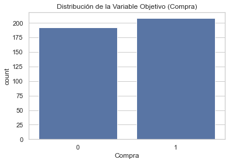
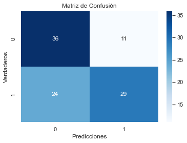
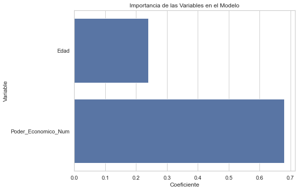
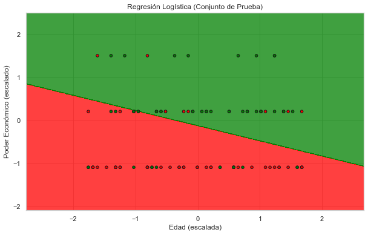

# Proyecto de Regresión Logística: Predicción de Compra de Perfumes

## Tabla de Contenidos

- [Descripción](#descripción)
- [Tecnologías Utilizadas](#tecnologías-utilizadas)
- [Instalación](#instalación)
- [Uso](#uso)
  - [1. Creación del Dataset](#1-creación-del-dataset)
  - [2. Procesamiento y Modelado](#2-procesamiento-y-modelado)
- [Análisis de Resultados](#análisis-de-resultados)
  - [1. Descripción del Dataset](#1-descripción-del-dataset)
  - [2. Evaluación del Modelo](#2-evaluación-del-modelo)
  - [3. Interpretación de los Coeficientes](#3-interpretación-de-los-coeficientes)
  - [4. Área de Decisión del Modelo en el Conjunto de Prueba](#3-Área-de-Decisión-del-Modelo-en-el-Conjunto-de-Prueba)

## Descripción

Este proyecto tiene como objetivo desarrollar un modelo de **Regresión Logística**(Aunque hay otros con los que se puede hacer una predicción mejor) para predecir si un conjunto de mujeres comprará un perfume en función de su **edad** y **poder económico**. Inicialmente, se consideró incluir la variable **residencia** (Pueblo, Ciudad, Gran Ciudad),

Pero añadía más complejidad al problema y al ser una regresión lineal era imposible hacer una separación con una tasa de aciertos aceptable. 

## Tecnologías Utilizadas

- **Lenguajes de Programación:**
  - Python 3.12
- **Entornos de Desarrollo:**
  - Spyder 5
- **Librerías de Python:**
  - `numpy`
  - `pandas`
  - `matplotlib`
  - `seaborn`
  - `scikit-learn`

## Instalación

```bash
git clone https://github.com/moises60/Regresion-logistica-machine-learning.git
```
### Uso 
### Creación del Dataset 
 crear_dataset_perfume.py
 Este script genera un dataset con información sobre la edad, poder económico y si una mujer compró o no un perfume. esta echo de forma aleatoria dando mas valor a suposiciones personañles. ya que no es un dataset 
 real pero lo importate es analizar los datos del dataset. y que estos tengan una cierta coerencia 

 ### Procesamiento y Modelado
  python regresion_logistica_perfume.py
  Este script carga el dataset generado, realiza el preprocesamiento de datos, entrena el modelo de regresión logística, evalúa su desempeño y genera visualizaciones.

## Análisis de Resultado

## 1. Descripción del Dataset


- La distribución de la variable objetivo está relativamente balanceada, con una ligera mayoría de mujeres que compraron el perfume (52%) en comparación con las que no lo hicieron (48%).

## 2. Evaluación del Modelo


Verdaderos Negativos (TN): 36
Mujeres que no compraron el perfume y el modelo lo predijo correctamente.
Falsos Positivos (FP): 11
Mujeres que no compraron el perfume, pero el modelo predijo que sí lo harían.
Falsos Negativos (FN): 24
Mujeres que compraron el perfume, pero el modelo predijo que no lo harían.
Verdaderos Positivos (TP): 29
Mujeres que compraron el perfume y el modelo lo predijo correctamente.

Reporte de Clasificación
              precision    recall  f1-score   support

           0       0.60      0.77      0.67        47
           1       0.72      0.55      0.62        53

    accuracy                           0.65       100

El modelo es más efectivo en predecir la clase 0 (No Compra), con un recall alto de 77%, lo que indica que es bueno para identificar a las mujeres que realmente no comprarán el perfume.
Sin embargo, el rendimiento en la clase 1 (Compra) es moderado, con un recall de 55%, lo que sugiere que el modelo tiene dificultades para identificar correctamente a todas las mujeres que sí comprarán el perfume.

El modelo logra una precisión global del 65%, lo que indica un desempeño aceptable pero con margen de mejora, especialmente en la identificación de las mujeres que comprarán el perfume.

## 3. Interpretación de los Coeficientes



Ambos coeficientes indican que cuanto masyor es la edad o mayor es el poder economico hay mas posibilidades de comprarlo pero no es una regla lineal. 


## 4. Área de Decisión del Modelo en el Conjunto de Prueba

 

La gráfica ilustra cómo el modelo de regresión logística separa las clases en función de la Edad y el Poder Económico.
Las áreas verdes representan predicciones de compra, mientras que las áreas rojas representan predicciones de no compra.


